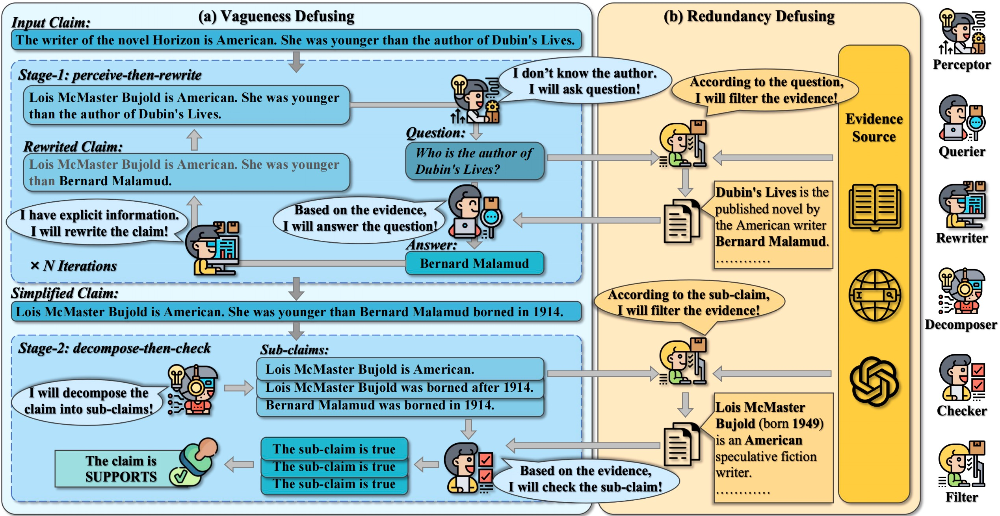

# BiDeV: Bilateral Defusing Verification for Complex Claim Fact-Checking [AAAI2025 **Oral**]  

Official implementation for our paper [BiDeV: Bilateral Defusing Verification for Complex Claim Fact-Checking](https://arxiv.org/abs/2502.16181)

## Introduction

Complex claim fact-checking performs a crucial role in disinformation detection. 
However, existing fact-checking methods struggle with claim vagueness, specifically in effectively handling latent information and complex relations within claims.
Moreover, evidence redundancy, where nonessential information complicates the verification process, remains a significant issue.
To tackle these limitations, we propose ***Bi**lateral **De**fusing **V**erification* (**BiDeV**), a novel fact-checking working-flow framework integrating multiple role-played LLMs to mimic the human-expert fact-checking process. 
BiDeV consists of two main modules: *Vagueness Defusing* identifies latent information and resolves complex relations to simplify the claim, and *Redundancy Defusing* eliminates redundant content to enhance the evidence quality.
Extensive experimental results on two widely used challenging fact-checking benchmarks (Hover and Feverous-s) demonstrate that our BiDeV can achieve the best performance under both gold and open settings. This highlights the effectiveness of BiDeV in handling complex claims and ensuring precise fact-checking.



## Preparation

Create the environment and install the required packages.

```bash
conda create -n bidev python=3.8
conda activate bidev
pip install -r requirements.txt
```
Build corpus index of Hover and Feverous-s.

```bash
bash scripts/build_hover_index.sh
bash scripts/build_feverous_index.sh
```
## Run BiDeV

```bash
bash scripts/run.sh 
```

## Run Evaluation

```bash
bash scripts/eval.sh
```

## Citation

Please cite the paper in the following format.

```bibtex
@inproceedings{liu2025bidev,
  title={Bidev: Bilateral defusing verification for complex claim fact-checking},
  author={Liu, Yuxuan and Sun, Hongda and Guo, Wenya and Xiao, Xinyan and Mao, Cunli and Yu, Zhengtao and Yan, Rui},
  booktitle={Proceedings of the AAAI Conference on Artificial Intelligence},
  volume={39},
  number={1},
  pages={541--549},
  year={2025}
}
```
